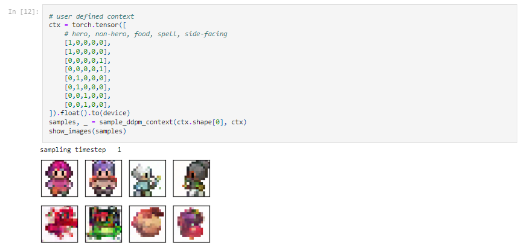

# Tiny Image Generator Using Diffusion Models

This repository contains a project for building a tiny image generator based on Diffusion Models, focusing on enhancing the generation process while incorporating user prompts or context.

## Overview

The project implements a U-Net architecture for image denoising within the context of Diffusion Models using PyTorch. It integrates context features and time embeddings to enhance image generation, effectively learning temporal and contextual dependencies. The model consists of:

- An initial convolutional layer
- A down-sampling path
- Embedding layers for time and context
- An up-sampling path
- A final output layer

The diffusion process utilizes a constructed noise schedule, and the sampling function iteratively refines images while visualizing the denoising progression. Overall, this implementation serves as a powerful tool for generative modeling tasks in computer vision.

## Notebook

The primary implementation is found in the following Jupyter Notebook:

- [Diffusion Model U-Net](https://github.com/TechWithRamaa/Tiny-Image-Generator-Using-Diffusion-Models/blob/main/Diffusion_model_UNet.ipynb)
- [Speeding_Up_Image_Generation](https://github.com/TechWithRamaa/Tiny-Image-Generator-Using-Diffusion-Models/blob/main/Speeding_Up_Image_Generation.ipynb)

## Features

- User prompt/context integration for personalized image generation
- Efficient image denoising with temporal and contextual learning
- Visualization of the denoising progression

## Requirements

To run this project, ensure you have the following libraries installed:

- `torch`
- `torchvision`
- `numpy`
- `matplotlib`
- `tqdm`
- Any other dependencies listed in the notebook

## Architecture:
 - A modified U-Net with additional context embedding layers and a perturbation function to handle noise during the denoising process
## Sampling Function:
 - Implements the standard DDPM (Denoising Diffusion Probabilistic Models) sampling algorithm, refining generated images over multiple timesteps while injecting noise at specified levels.
## Visualization:
- Includes capabilities to visualize the generated samples and the denoising progression over time, providing insight into the model's performance.

## [Image Generation with Prompts](https://github.com/TechWithRamaa/Tiny-Image-Generator-Using-Diffusion-Models/blob/main/Prompting_Diffusion_Model_With_Context.ipynb)

The model allows users to generate images by providing context prompts. Users can specify different attributes in the prompts to guide the image generation process.

### Prompt Format
The context tensor is structured as follows:
- Each row corresponds to a specific image generation prompt.
- Each column represents a feature category:
  - Hero (1 = Yes, 0 = No)
  - Non-Hero (1 = Yes, 0 = No)
  - Food (1 = Yes, 0 = No)
  - Spell (1 = Yes, 0 = No)
  - Side-Facing (1 = Yes, 0 = No)

- 
    
## Usage

1. Clone the repository:
   ```bash
   git clone https://github.com/TechWithRamaa/Tiny-Image-Generator-Using-Diffusion-Models.git
   cd Tiny-Image-Generator-Using-Diffusion-Models

2. Open the Jupyter Notebook and run the cells to train and generate images.

## License
This project is licensed under the MIT License. See the LICENSE file for more details.

## Contributing
Contributions are welcome! Please open an issue or submit a pull request to contribute to this project.

## Acknowledgments
Special thanks to DeepLearning.AI for mentorship
